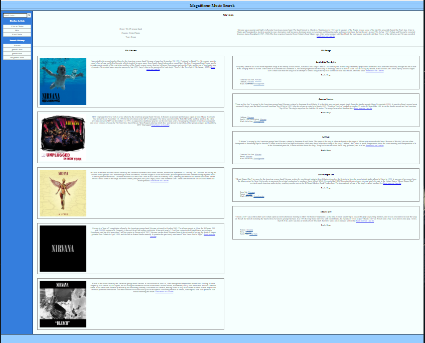

# Magnificent Music Search

## Table of Contents
1. [General Info](#general-info)
2. [Technologies](#technologies)
3. [Installation](#installation)
4. [Usage](#usage)
5. [Collaboration](#collaboration)
6. [Deployed Site](#deployed-site)
7. [Github](#github)
8. [eMail](#email)
9. [FAQs](#faqs)

# General Info
* This is a website that offers users information relating to a music artist they input in the search field
* 

# Technologies
* This website was created with HTML, Tachyons, and Javascript code on Microsoft Visual Studio Code.

# Installation
* Go to https://github.com/apal96/magnificent-music-search and copy the repository on Github by clicking the green code button.
* Open your terminal, navigate to destination you want to download this repository, and run the command:
    * $ git clone https://github.com/apal96/magnificent-music-search.git

# Usage
* The current version of the website can be accessed at the url: ADD URL
* This website can be navigated with the links on the website to learn about similar music

# Collaboration
* The developers of this website is Troy Johnson, Sam Lingampalli, and Alisha Pal.

# Deployed Site
* The deployed site can be accessed in browser at https://apal96.github.io/magnificent-music-search/

# Github
* The Repository can be accessed on Github at https://github.com/apal96/magnificent-music-search

# eMail
* The best way to contact the creators of this website by email. 
*To contact Troy Johnson, email tnj8510@gmail.com.
*To contact Sam Lingampalli, email sam.l.full.stack@gmail.com.
*To contact Alisha Pal, email alishapal96@gmail.com.

# Frequently Asked Questions
* There are no frequently asked questions.